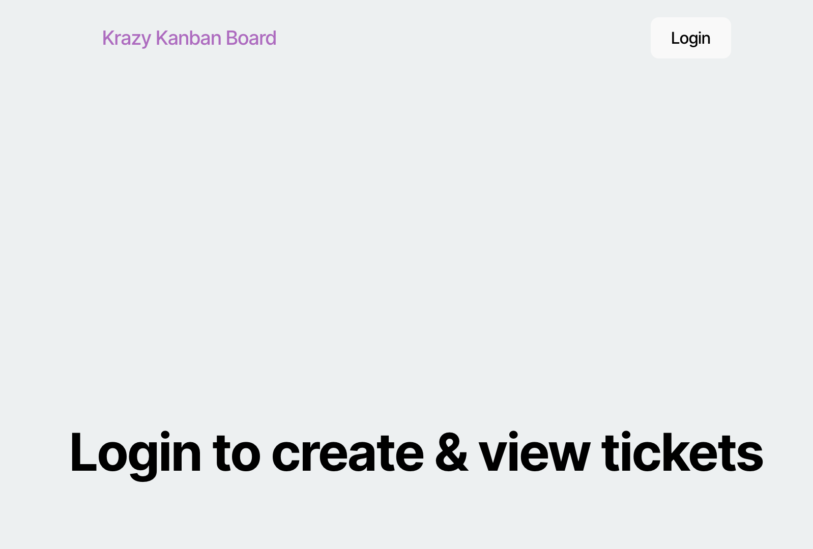
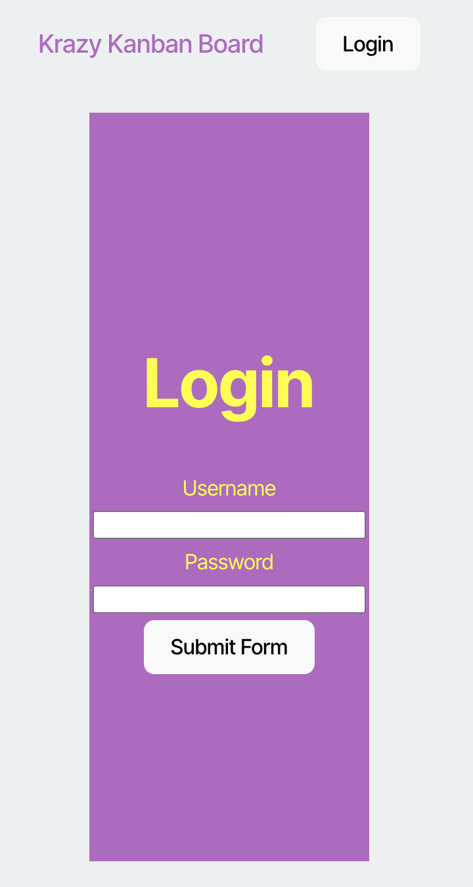
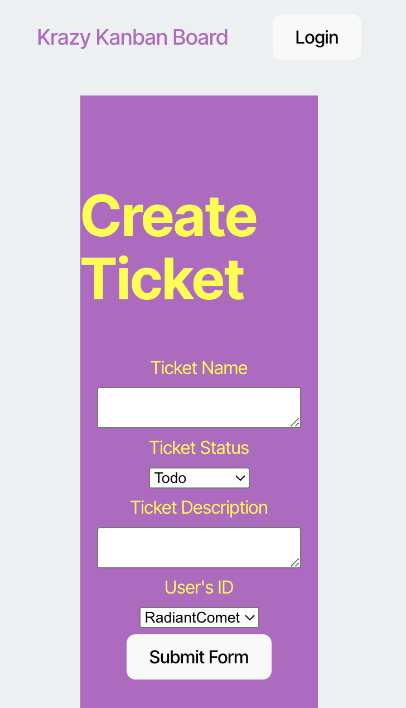

# Kanban Board Project

This project is a Kanban board application that allows users to manage tasks effectively. It includes features such as user authentication, task management, and role-based access.

## Screenshots

### Home Page:

### Login Page:

### Create Page:

## Deployed Application

[Linked Here](https://kanbanboard1-25vd.onrender.com/)

## **License**
This project is licensed under the MIT License. 

